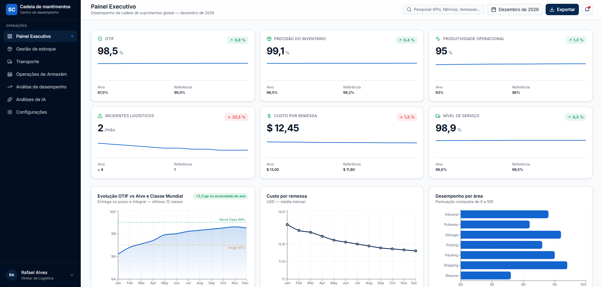
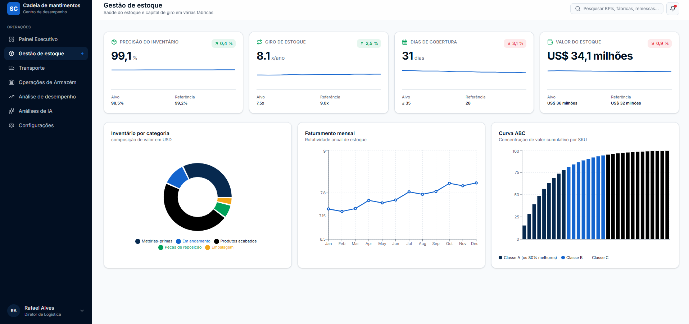
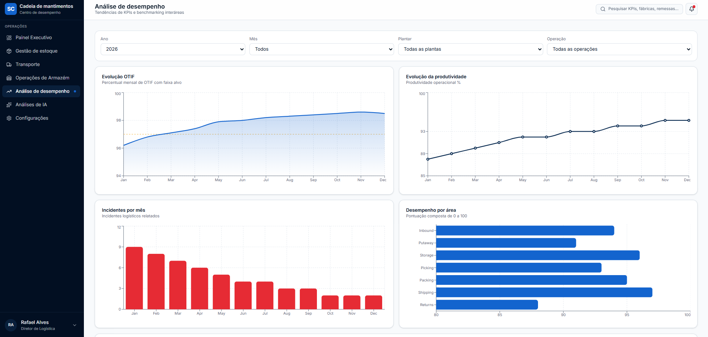

# logistics-dashboard
Logistics Performance Dashboard project for KPI monitoring, inventory accuracy, OTIF and operational performance analysis.
# 📊 Painel de Logística

## Sobre o Projeto

Este projeto foi criado como parte da minha jornada de aprendizado em Análise de Dados, Inteligência Artificial e Tecnologia aplicada à Logística.

O objetivo é desenvolver um painel de indicadores logísticos que permita acompanhar o desempenho operacional por meio de métricas estratégicas.

## Indicadores Monitorados

- OTIF (On Time In Full)
- Acuracidade de Estoque
- Produtividade Operacional
- Movimentações Logísticas
- Incidentes Logísticos
- Tendência Mensal de Performance

## Ferramentas Utilizadas

- Excel
- Power Query
- Power Pivot
- Power BI (próximas versões)
- Python (futuras análises)

## Objetivo

Transformar dados em informações para apoiar a tomada de decisão e identificar oportunidades de melhoria contínua nas operações logísticas.

## Status

🚧 Projeto em desenvolvimento
# Screenshots

## Executive Dashboard

## Inventory Management

## Performance Analytics

